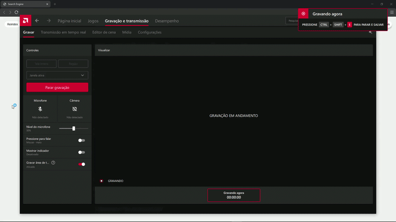

# Full-Text Search Engine (C++ + Node.js + Web UI)

## Description

A full-text search engine built from scratch in C++, featuring an inverted index and TF-IDF ranking.  
The project is integrated with a Node.js backend and a clean web interface that supports search, autocomplete, and reindexing. 
I started this project intending it to be just a basic CLI engine, 
but after a friend almost kicked my- scolded me for noticing it could be improved, here it is. 
I hope I didn't get carried away; I learned a lot during this project.

This project demonstrates core concepts of information retrieval, backend integration, and frontend development.

---

## Features

- Inverted index implementation
- TF-IDF based ranking
- Persistent index storage (`index.dat`)
- Command-line interface with query arguments
- REST API using Node.js
- Web interface with:
  - Search functionality
  - Autocomplete (with debounce)
  - Dark mode
  - Reindex button
- JSON-based communication between C++ and Node.js
- Accent-insensitive search (basic normalization)

---

## Architecture

Frontend (HTML/CSS/JS)  
↓  
Node.js (Express API)  
↓  
C++ Search Engine (CLI)

---

## How It Works

1. Text files are indexed using an inverted index.
2. The index is stored on disk for faster queries.
3. Queries are processed using TF-IDF scoring.
4. The Node.js server executes the C++ binary using `execFile`.
5. Results are returned as JSON and displayed in the web interface.

---

## Endpoints

### GET /search?q=term
Returns ranked search results.

### GET /autocomplete?q=prefix
Returns suggestions based on indexed terms.

### POST /reindex
Rebuilds the index from source files.

---

## Project Structure
project/
├── backend/
│ ├── server.js
│ ├── index.html
│ └── assets/
├── src/
│ ├── main.cpp
│ ├── SearchEngine.cpp
│ └── SearchEngine.h
├── data/
│ ├── file1.txt
│ └── file2.txt
├── storage/
│ └── index.dat
├── bin/
│ └── search_engine
└── README.md

---

## How to Run

### 1. Compile the C++ engine
g++ src/main.cpp src/SearchEngine.cpp -o bin/search_engine

### 2. Start the server
cd backend
node server.js

### 3. Open in browser
http://localhost:3000

---

## Notes

- Reindexing is required after modifying source files.
- File paths are relative to the project root.
- The system uses simple text normalization and may not fully support all Unicode cases.

---

# Motor de Busca Full-Text (C++ + Node.js + Interface Web)

## Descrição

Um motor de busca full-text desenvolvido em C++, utilizando índice invertido e ranking por TF-IDF.  
O projeto é integrado com um backend em Node.js e uma interface web com busca, autocomplete e reindexação. 
Fiz esse projeto com o intuito de ser apenas um motor básico CLI, 
porém depois de tomar um esporro de um amigo falando que dava pra melhorar isso, ta ai, 
tomare que não tenha me empolgado, aprendi muita coisa ao longo desse projeto.

---

## Funcionalidades

- Índice invertido
- Ranking com TF-IDF
- Persistência (`index.dat`)
- Interface CLI com argumentos
- API REST com Node.js
- Interface web com:
  - Busca
  - Autocomplete
  - Modo escuro
  - Botão de reindex
- Comunicação em JSON entre C++ e Node.js
- Busca sem acento (normalização básica)

---

## Arquitetura

Frontend (HTML/CSS/JS)  
↓  
Node.js (Express)  
↓  
Motor de Busca em C++

---

## Como Funciona

1. Arquivos são indexados em um índice invertido.
2. O índice é salvo em disco.
3. A busca usa TF-IDF para ranqueamento.
4. O Node executa o binário C++.
5. Os resultados são retornados em JSON.

---

## Endpoints

### GET /search?q=termo
Retorna resultados ranqueados.

### GET /autocomplete?q=prefixo
Retorna sugestões.

### POST /reindex
Reconstrói o índice.

---

## Como Executar

### 1. Compilar
g++ src/main.cpp src/SearchEngine.cpp -o bin/search_engine

### 2. Rodar servidor
cd backend
node server.js

### 3. Abrir no navegador
http://localhost:3000

---

## Observações

- É necessário reindexar após alterar arquivos
- Caminhos são relativos ao projeto
- Suporte Unicode é limitado

## Demo

